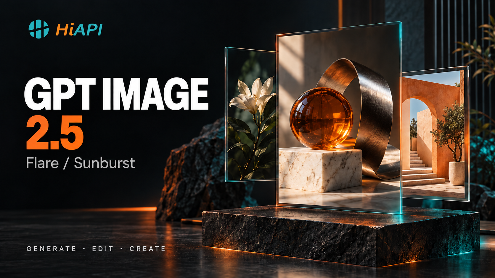

# GPT Image 2.5 Agent Skill — Image Generation & Editing with HiAPI

Generate product images, poster covers, transparent assets, or reference edits through HiAPI from Codex or Claude Code with the exact model IDs `gpt-image-2.5-flare` and `gpt-image-2.5-sunburst`; Flare is the default and Sunburst is selected explicitly.

Published skill package. Install with the Agent Skills CLI after verifying the repository URL; keep client runtime and paid-task acceptance separate.

[中文](README.zh-CN.md) · [English](README.md) · [Flare docs](https://www.hiapi.ai/docs/models/image/gpt-image-2-5-flare/) · [Sunburst docs](https://www.hiapi.ai/docs/models/image/gpt-image-2-5-sunburst/) · [API keys](https://www.hiapi.ai/en/dashboard/api-keys) · [Pricing](https://www.hiapi.ai/en/pricing) · [Install](#installation)

## What you can do

| Scenario | Use | Contract detail |
| --- | --- | --- |
| Product images | Create a clean product scene from a prompt | Text-to-image; omit `image_urls` |
| Poster or cover art | Set a supported ratio or pixel size for a campaign asset | One image per task; choose `aspect_ratio` explicitly |
| Reference editing | Change a defined element while preserving the supplied image | Image-to-image; send 1–16 accessible URLs |
| Transparent assets | Request an isolated subject or transparent graphic | `background: transparent` with `png` or `webp` |

Features follow the public schema: prompts up to 32,000 characters, 1–16 public HTTP(S) reference URLs, supported aspect-ratio/pixel-size values, six quality values, three background values, and PNG/JPEG/WebP output. Each accepted async task returns one image.

## Installation

Requires Node.js 18+. Install the local checkout into an explicit empty directory:

```bash
node scripts/install.mjs --target /tmp/hiapi-gpt-image-2-5-skill
```

Recommended Agent Skills CLI installation:

```bash
npx skills add HiAPIAI/hiapi-gpt-image-2-5-skill --skill hiapi-gpt-image-2-5
```

The bundled installer also supports `--codex`, `--claude`, and an explicit `--target`; client runtime acceptance is separate.

Set `HIAPI_API_KEY` only for task creation or recovery. Keep it out of shell history and logs. `HIAPI_BASE_URL` optionally overrides the API base for a controlled environment; `HIAPI_SITE_URL` optionally overrides the pricing/contract site.

Preflight is free and prints the redacted payload. `--estimate` reads current public pricing; it does not create a task:

```bash
node scripts/hiapi-gpt-image-2-5.mjs \
  --model gpt-image-2.5-flare --prompt "A quiet alpine lake at dawn" \
  --aspect-ratio 16:9 --quality medium --background auto \
  --output-format webp --dry-run --estimate
```

Create text-to-image once, with an explicit reusable key:

```bash
export HIAPI_API_KEY='...'
node scripts/hiapi-gpt-image-2-5.mjs \
  --model gpt-image-2.5-flare --prompt "A quiet alpine lake at dawn" \
  --idempotency-key gpt25-demo-001
```

Edit with Sunburst by repeating `--image-url` (1–16 public HTTP(S) URLs):

```bash
node scripts/hiapi-gpt-image-2-5.mjs \
  --model gpt-image-2.5-sunburst \
  --prompt "Change only the sky to a warm sunset; preserve the subject and composition." \
  --image-url "https://example.com/reference.webp" \
  --aspect-ratio 1:1 --quality high --output-format webp \
  --idempotency-key gpt25-edit-001
```

For a local source, first provide an accessible HTTP(S) URL; this CLI does not upload local paths. `--no-wait` returns the task ID after submission. Resume or download without another create call:

```bash
node scripts/hiapi-gpt-image-2-5.mjs --resume-task-id "tk-hiapi-REPLACE_WITH_YOUR_TASK_ID"
node scripts/hiapi-gpt-image-2-5.mjs --resume-task-id "tk-hiapi-REPLACE_WITH_YOUR_TASK_ID" --no-save
```

Run checks locally with `npm test` and `npm run check:contract`. See [README.zh-CN.md](README.zh-CN.md), [llms-install.md](llms-install.md), [references/api.md](references/api.md), and [references/workflow.md](references/workflow.md).

## FAQ

**How is GPT Image 2.5 different from GPT Image 2?** This skill targets only `gpt-image-2.5-flare` and `gpt-image-2.5-sunburst`. GPT Image 2 and other image models are outside its invocation boundary; compare their current model documentation separately.

**Which 2.5 model should I use?** Flare is the default. Select Sunburst when it is explicitly requested. The skill makes no unsupported quality, speed, or visual ranking between them.

**Is this an API or a skill?** HiAPI provides the async API and model contract; this repository packages a repeatable Agent Skills workflow around it, including validation, estimates, idempotency, polling, resume, and download.

**Do I need a key, and what does it cost?** `HIAPI_API_KEY` is required for creation and recovery, not dry-run validation. Use `--estimate` for the current `/api/pricing` snapshot; estimates are not billing guarantees and accepted tasks follow current pricing.

**How do transparent backgrounds work?** Set `--background transparent` and choose `--output-format png` or `webp`; JPEG cannot carry transparency.

**Can I install or recover without an API key?** Installation and dry-run are local. Recovery needs the key and an existing task ID, but does not create a new task. Use `--resume-task-id` after a timeout or `--no-wait` submission.

**Can I pass a local image file?** The CLI does not upload local paths. Make the source available as a public HTTP(S) URL and pass repeated `--image-url` values, or use the direct API with an accessible URL. Do not expose private media merely to make it reachable.
