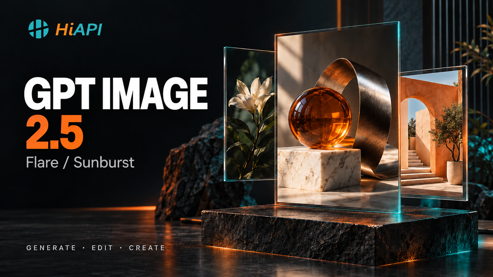

# GPT Image 2.5 Agent Skill — Image Generation & Editing with HiAPI

Generate product images, poster covers, transparent assets, or reference edits through HiAPI from Codex or Claude Code with GPT Image 2.5 Flare or Sunburst. By default the CLI picks the resolution-priced mode model from your input — `gpt-image-2.5-flare/text-to-image` without reference images, `gpt-image-2.5-flare/image-to-image` with them — and `--family sunburst` switches to the Sunburst pair. The quality-tier IDs `gpt-image-2.5-flare` and `gpt-image-2.5-sunburst` remain available when selected explicitly.

Published skill package. Install with the Agent Skills CLI after verifying the repository URL; keep client runtime and paid-task acceptance separate.

[中文](README.zh-CN.md) · [English](README.md) · [Flare text-to-image](https://www.hiapi.ai/docs/models/image/gpt-image-2-5-flare-text-to-image/) · [Flare image-to-image](https://www.hiapi.ai/docs/models/image/gpt-image-2-5-flare-image-to-image/) · [Sunburst text-to-image](https://www.hiapi.ai/docs/models/image/gpt-image-2-5-sunburst-text-to-image/) · [Sunburst image-to-image](https://www.hiapi.ai/docs/models/image/gpt-image-2-5-sunburst-image-to-image/) · [Flare quality tiers](https://www.hiapi.ai/docs/models/image/gpt-image-2-5-flare/) · [Sunburst quality tiers](https://www.hiapi.ai/docs/models/image/gpt-image-2-5-sunburst/) · [API keys](https://www.hiapi.ai/en/dashboard/api-keys) · [Pricing](https://www.hiapi.ai/en/pricing) · [Install](#installation)

## What you can do

| Scenario | Use | Contract detail |
| --- | --- | --- |
| Product images | Create a clean product scene from a prompt | Text-to-image; omit `--image-url` |
| Poster or cover art | Pick a ratio and 1K/2K/4K output for a campaign asset | One image per task; `--aspect-ratio`, `--resolution` |
| Reference editing | Change a defined element while preserving the supplied image | Image-to-image; send 1–16 accessible URLs or data URIs |
| Transparent assets | Request an isolated subject or transparent graphic | `--background transparent` at resolution 1K |

## Model routes

| Route | Model IDs | Selected when | Pricing basis | Controls |
| --- | --- | --- | --- | --- |
| Mode (default) | `gpt-image-2.5-flare/text-to-image`, `gpt-image-2.5-flare/image-to-image`, `gpt-image-2.5-sunburst/text-to-image`, `gpt-image-2.5-sunburst/image-to-image` | `--model` omitted; mode follows whether `--image-url` is present; `--family` defaults to `flare` | per image by `resolution` (1K/2K/4K) | prompt ≤ 20,000 chars, 13 aspect ratios (default `auto`), `resolution` (default `1K`), optional `background` (1K only) |
| Quality tier (explicit) | `gpt-image-2.5-flare`, `gpt-image-2.5-sunburst` | `--model` names one of these IDs | per image by `quality` | prompt ≤ 32,000 chars, ratios or pixel sizes, six quality values, background, PNG/JPEG/WebP output |

Each accepted async task returns one image. The CLI rejects `--quality`/`--output-format` on the mode route and `--resolution` on the quality-tier route instead of silently dropping them. The skill makes no quality, speed, or visual ranking between the routes or between Flare and Sunburst.

## Installation

Requires Node.js 18+. Install the local checkout into an explicit empty directory:

```bash
node scripts/install.mjs --target /tmp/hiapi-gpt-image-2-5-skill
```

Recommended Agent Skills CLI installation:

```bash
npx skills add HiAPIAI/hiapi-gpt-image-2-5-skill --skill hiapi-gpt-image-2-5
```

The bundled installer also supports `--codex`, `--claude`, and an explicit `--target`; client runtime acceptance is separate.

Set `HIAPI_API_KEY` only for task creation or recovery. Keep it out of shell history and logs. `HIAPI_BASE_URL` optionally overrides the API base for a controlled environment; `HIAPI_SITE_URL` optionally overrides the pricing/contract site.

Preflight is free and prints the redacted payload. `--estimate` reads current public pricing; it does not create a task:

```bash
node scripts/hiapi-gpt-image-2-5.mjs \
  --prompt "A quiet alpine lake at dawn" \
  --aspect-ratio 16:9 --resolution 2K --dry-run --estimate
```

Create text-to-image once (default `gpt-image-2.5-flare/text-to-image`), with an explicit reusable key:

```bash
export HIAPI_API_KEY='...'
node scripts/hiapi-gpt-image-2-5.mjs \
  --prompt "A quiet alpine lake at dawn" --resolution 2K \
  --idempotency-key gpt25-demo-001
```

Edit with Sunburst by repeating `--image-url` (1–16 public HTTP(S) URLs or `data:image/...;base64,` URIs); the CLI selects `gpt-image-2.5-sunburst/image-to-image`:

```bash
node scripts/hiapi-gpt-image-2-5.mjs --family sunburst \
  --prompt "Change only the sky to a warm sunset; preserve the subject and composition." \
  --image-url "https://example.com/reference.webp" \
  --aspect-ratio 1:1 --resolution 1K \
  --idempotency-key gpt25-edit-001
```

Use a quality tier only by naming its exact ID:

```bash
node scripts/hiapi-gpt-image-2-5.mjs --model gpt-image-2.5-sunburst \
  --prompt "A quiet alpine lake at dawn" --quality high --output-format webp \
  --dry-run --estimate
```

For a local source, first provide an accessible HTTP(S) URL; this CLI does not upload local paths. `--no-wait` returns the task ID after submission. Resume or download without another create call:

```bash
node scripts/hiapi-gpt-image-2-5.mjs --resume-task-id "tk-hiapi-REPLACE_WITH_YOUR_TASK_ID"
node scripts/hiapi-gpt-image-2-5.mjs --resume-task-id "tk-hiapi-REPLACE_WITH_YOUR_TASK_ID" --no-save
```

Run checks locally with `npm test` and `npm run check:contract`. See [README.zh-CN.md](README.zh-CN.md), [llms-install.md](llms-install.md), [references/api.md](references/api.md), and [references/workflow.md](references/workflow.md).

## FAQ

**How is GPT Image 2.5 different from GPT Image 2?** This skill targets only the six GPT Image 2.5 Flare/Sunburst IDs listed above. GPT Image 2 and other image models are outside its invocation boundary; compare their current model documentation separately.

**Which 2.5 model should I use?** Omit `--model`: the CLI uses Flare's text-to-image or image-to-image model depending on whether you pass reference images. Add `--family sunburst` when Sunburst is requested, or name `gpt-image-2.5-flare` / `gpt-image-2.5-sunburst` when you specifically need quality tiers or a PNG/JPEG/WebP output choice. The skill makes no unsupported quality, speed, or visual ranking between them.

**Is this an API or a skill?** HiAPI provides the async API and model contract; this repository packages a repeatable Agent Skills workflow around it, including validation, estimates, idempotency, polling, resume, and download.

**Do I need a key, and what does it cost?** `HIAPI_API_KEY` is required for creation and recovery, not dry-run validation. Use `--estimate` for the current `/api/pricing` snapshot; estimates are not billing guarantees and accepted tasks follow current pricing.

**How do transparent backgrounds work?** On the default mode route, set `--background transparent` at `--resolution 1K` (the only resolution that accepts `background`); the result is a PNG with alpha. On a quality-tier ID, set `--background transparent` with `--output-format png` or `webp`; JPEG cannot carry transparency.

**Can I install or recover without an API key?** Installation and dry-run are local. Recovery needs the key and an existing task ID, but does not create a new task. Use `--resume-task-id` after a timeout or `--no-wait` submission.

**Can I pass a local image file?** The CLI does not upload local paths. On the default mode route you can pass a `data:image/png|jpeg|webp;base64,` URI; otherwise make the source available as a public HTTP(S) URL and pass repeated `--image-url` values. Do not expose private media merely to make it reachable.
